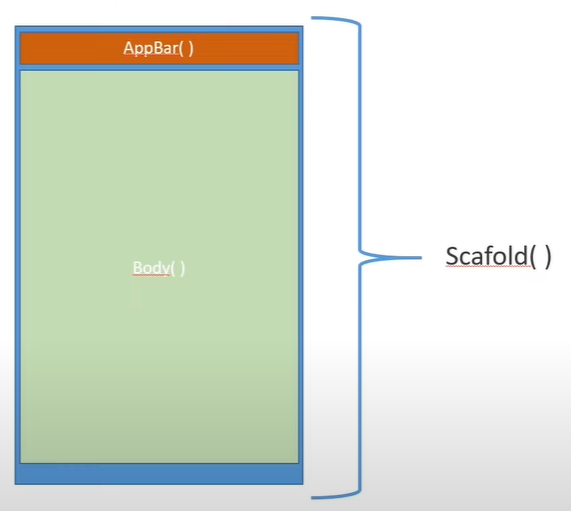
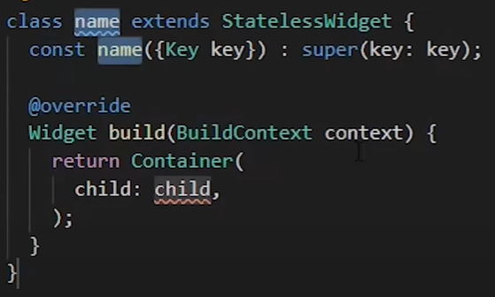
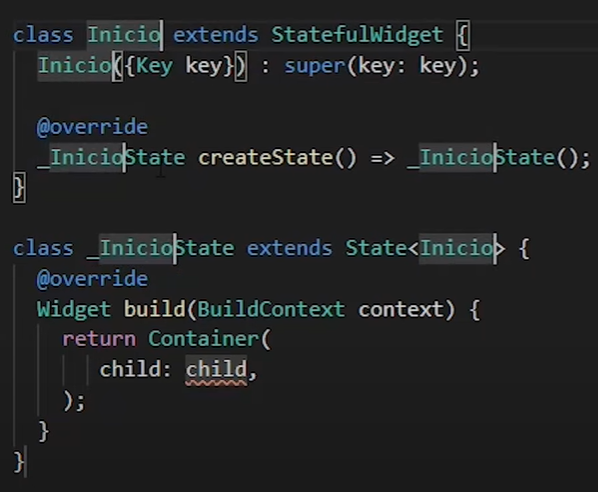

#  Estructura de una App 

La estructura de flutter se compone por Widgets porque todo lo que se ve en una aplicacion con flutter se compone de widgets de mayor o menor medida 

## Funcion Main

La funcion main es la primera funcion que se ejecuta en el lenguaje dart lo que hace esta funcion es llamar al primer Widget o el widget principal.No devuelve nada

## Estructura de una aplicacion 

La estructura basica de una aplicacion se compone de la siguiente forma:

- **Scaffold** Es la estructura tradicional que contiene una aplicacion 

- **Appbar** El appbar es el wigdet donde se guarda todo lo de las barras en la aplicacion

- **Body** Es el lugar donde se va a hubicar el widget del contenido 

 
 

## Iniciando con la construcion de una App

Primero se debe importar las librerias de material.dart con 

    import 'package:flutter/material.dart';

Despues seguimos con la creacion de la funcion "main" asi

    void main() => runApp(const MiApp()); //Dentro de las () espesificamos el widget principal de la app

Ya solo falta el widget principal que estamos nombrando y para crear este widget usamos las palabras "statelessWidget" que nos crea este widget principal 

Donde esta "name" es el nombre del widget 

    class MiApp extends StatelessWidget { //clase del widget que creamos
    const MiApp({super.key});

    @override //Constructor de la clase de lo queramos costruir
    Widget build(BuildContext context) {
        return const MaterialApp(  //lo que queremos que nos retorne es una aplicacion de material
        title:"Mi primera App", //Esta aplicacion nos pide el parametro de "title" que es el nombre de la app
        home: Inicio(), //Este constructor es el que llama a la class Inicio extends StatefulWidget que inicia todo el Scafold
        );
        }
    }

Seguimos con la cosntrucion de la app con las construcion de la clase Incio() con una palabra llamada "StatelessWidget" que nos construlle esto donde guarda el widget de inicio 

    class Inicio extends StatefulWidget {
    const Inicio({super.key});

    @override
    State<Inicio> createState() => _InicioState();
    }

    class _InicioState extends State<Inicio> {
        @override
        Widget build(BuildContext context) {
            return Scaffold( //Es el contenido de la app
                appBar: AppBar( //es la barra que se va a mostrar en el dispositivo
                    title: Text("mi app) //el titulo que va ser un texto 
                ),
                body: Center(chil: Text ("Contenido), //Body es donde esta el contenido y especificamos donde va a estar en el centro y que va a contener un texto
                ),
            ); 
      }
    }

El resultado del codigo

lo que importa es el returno que toca especifica que tipo de app sera y sera una con el Scaffold