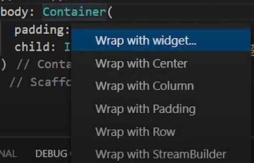
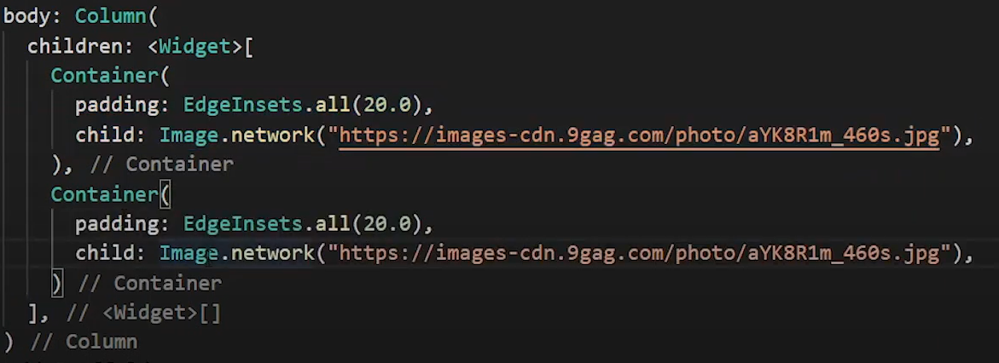

#  Imágenes, Container, Column y ListView 

Lo que vamos a hacer es traer una o varias imagenes de internet en flutter para esto nos dirijimos al body: de nuestra clase de inicio 

## Atajos 

uno de los atajos que podemos usar en flutter es que si no paramos en la palabra "Container" y le damos crtl + . se nos abren mas obciones como se ve

## Widgets Importantes

Estos son los widgets que se usaran en el capitulo 

- **Container**

    lo que hace este widget es contener a un child que a su vez puede contener varios widgets

- **Child**

    Child lo que quiere significar es para asignar un solo hijo este solo es exclusivo de siertos widgets como Container

- **Children**
    
    Children es para asignar varios hijos, estos son usados en widgets que usan varios hijos como por ejemplo el ListView, Column, Row, Stack. Quisiera agregar que child y children son exclusivos de ciertos widgets, tambien se necesita decir que tiene widget asi <widget>.

    

- **Image**

    es el widget que contiene la imagen podemos especificar con el . si lo queremos de internet la imagen

- **ListView**

    lo que significa este widget es que contiene lista de lista en su interior puede contener varios container 