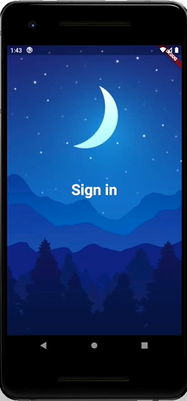
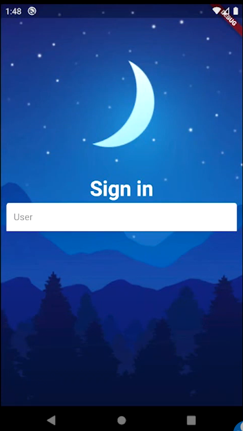
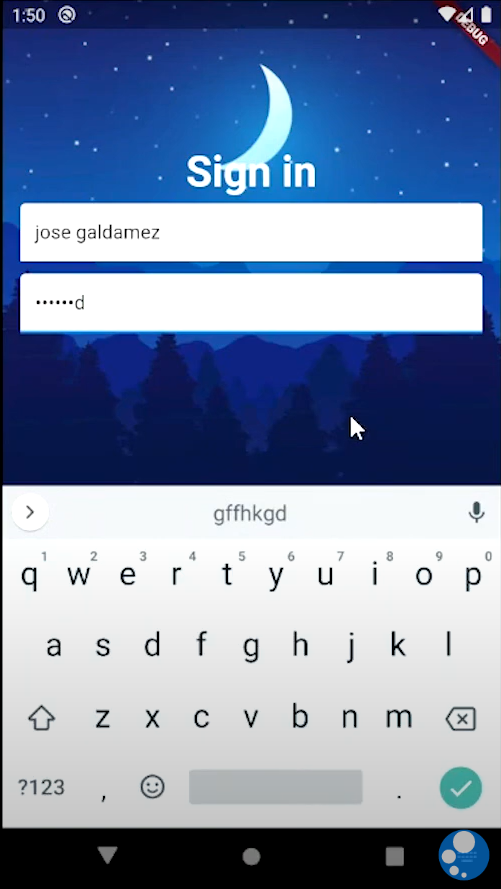
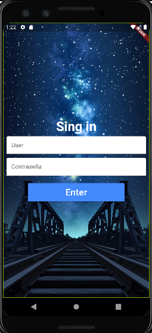

#  Widgets Separados 

Una buena practica en flutter es separar los widgets porque estos casi siempre viene conectados o acercado asi que se vera esa buena practica

## Pasos

Primero vamos a crear una clase con la palabra reservada de "Widget" en la cual se va a llamar cuerpo donde guardara nuestros widgets reparados y se compone asi 

    Widget cuerpo(){ //asi se crea una funcion que contiene el cuerpo y vamos a guardar el contenido 
    return Container( //contenedor que contiene los widgets que debe retornar 
    decoration: const BoxDecoration( //integracion de una imagen de fondo con la palabra "decoration"
      image: DecorationImage (image: NetworkImage("https://w.forfun.com/fetch/13/13527a890a0f9ad5bec0675cb0d1062c.jpeg"),
      fit:BoxFit.cover
      )
    ),
    child: Center(  //Espesificamos que este en el centro 
      child: Column( //insertamos column para que guarde varios widgets en columna 
      mainAxisAlignment: MainAxisAlignment.center, //Asignamos la orientacion en el centro
      children: <Widget> [ //contenedor de varios hijos y toca especificar los que tendra
        nombre(), //Nombramiento de las funciones del Widget que guardamos 
        campoUsuario(),
        contrasena(),
        SizedBox(height: 15,), //Este no es un widget es la separacion del widget que tiene la palabra reservada de SizedBox
        botonEntrar(),
                ],
            )
        )
        );
    }

## Creando clase Widget
 

### -**Widget Nombre**

Lo que sigue es la creacion de la clase de un widget de un contenedor de nombre y se va que tiene un estilo como se ve representado 
    
    Widget nombre(){ //Clase que se crea con Widget 
    return const Text("Sing in", style: TextStyle( // Un texto que contiene Sing in y el cual le ponemos estilo con style: TextStyle()
    color: Colors.white, //color de texto 
    fontSize: 35.0, //Tamaño de texto
    fontWeight: FontWeight.bold) //El tipo de letra de texto que es boid
        );
    }

### -**Widget Camposuario**

Seguimos con la creacion de una funcion de  campo de usuario donde se insertara texto y se hace de la siguiente forma 

    Widget campoUsuario(){
    return Container( //Es un contenedor
    padding: EdgeInsets.symmetric(horizontal: 10, vertical: 5),
    child: const TextField( //Es un input donde podemos inserta texto donde se guarda en una caja 
      decoration: InputDecoration( //lo que hacemos establecer el tipo de decoracion que tendra 
        hintText: "User", //El texto dentro de la caja 
        fillColor: Colors.white, //El color de la caja 
        filled: true //si es verdadero los cambios
                ),   
            ),
        );
    }

### -**Widget CampoContrasena**

La funcion contrasena seria igual que campo usuario pero esta tiene una caracteristica de ocultar los iconos con se ve ahora con obscureText

    Widget contrasena(){
    return Container( //Es un contenedor
    padding: EdgeInsets.symmetric(horizontal: 10, vertical: 5),
    child: const TextField( //Es un input donde podemos inserta texto 
      obscureText: true, //lo que hace este widget es ocultar las palabras de la caja de texto
      decoration: InputDecoration(
        hintText: "Contraseña",
        fillColor: Colors.white,
        filled: true
                ),   
            ),
        );
    }

### -**Widget BotonEntrar**

Insertaremos un boton con la reservada de MaterialButton que es una palabra reserva de material y nos crea un boton de la siguiente forma con la funcion botonEntrar

    Widget botonEntrar(){
    return MaterialButton( //Boton de material 
    padding: EdgeInsets.symmetric(horizontal: 100, vertical: 10), //Estableciendo el tamaño del boton de forma horizontal y vertical
    color: Colors.blueAccent, //Color de fondo del boton 
    onPressed: (){}, //Funcion al precionar el boton esta en null
    child: Text("Enter", style: TextStyle(fontSize: 25, color: Colors.white),), //Estableciendo el estilo de texto 
        );
    }

### Resultado

El resultado de esta buena practica es que se tiene un codigo mas compresinble y claro para ser usado y toca tener en cuenta que se pueden refenciar funciones de Widgets en otras carpetas del proyecto de Flutter para ser mas organizados 

    import 'package:flutter/material.dart';

    void main() => runApp(const MiApp());

    class MiApp extends StatelessWidget {
    const MiApp({super.key});

    @override
    Widget build(BuildContext context) {
    return const MaterialApp(
      title:"Mi primera App",
      home: Inicio(), //Este constructor es el que llama a la class Inicio extends StatefulWidget que inicia todo el Scafold
        );
      }
    }
    class Inicio extends StatefulWidget {
      const Inicio({super.key});
      @override
      State<Inicio> createState() => _InicioState();
    }

    class _InicioState extends State<Inicio> {
      @override
      Widget build(BuildContext context) {
        return Scaffold(
          // appBar: AppBar(title: const Text("Widgets"),), //quitamos el Appbard
          body:cuerpo(), //llamando a la funcion cuerpo
          ); 
      }
    }

    Widget cuerpo(){ //asi se crea una funcion que contiene el cuerpo y vamos a guardar el contenido 
      return Container( //contenedor que contiene los widgets
        decoration: const BoxDecoration(
          image: DecorationImage (image: NetworkImage("https://w.forfun.com/fetch/13/13527a890a0f9ad5bec0675cb0d1062c.jpeg"),
          fit:BoxFit.cover
          )
        ),
        child: Center(  //Espesificamos que este en el centro 
          child: Column( //insertamos column para que guarde varios widgets
          mainAxisAlignment: MainAxisAlignment.center,
          children: <Widget> [ //contenedor de varios hijos y toca especificar los que tendra
            nombre(),
            campoUsuario(),
            contrasena(),
            SizedBox(height: 15,),
            botonEntrar(),
          ],
          )
      ));
    }

    Widget nombre(){ //Clase que se crea con Widget 
      return const Text("Sing in", style: TextStyle( // Un texto que contiene Sing in y el cual le ponemos estilo con style: TextStyle()
        color: Colors.white, //color de texto 
        fontSize: 35.0, //Tamaño de texto
        fontWeight: FontWeight.bold) //El tipo de letra de texto
        );
    }

    Widget campoUsuario(){
      return Container( //Es un contenedor
        padding: EdgeInsets.symmetric(horizontal: 10, vertical: 5),
        child: const TextField( //Es un input donde podemos inserta texto donde se guarda en una caja 
          decoration: InputDecoration(
            hintText: "User",
            fillColor: Colors.white,
            filled: true
          ),   
        ),
      );
    }

    Widget contrasena(){
      return Container( //Es un contenedor
        padding: EdgeInsets.symmetric(horizontal: 10, vertical: 5),
        child: const TextField( //Es un input donde podemos inserta texto 
          obscureText: true, //lo que hace este widget es ocultar las palabras de la caja de texto
          decoration: InputDecoration(
            hintText: "Contraseña",
            fillColor: Colors.white,
            filled: true
          ),   
        ),
      );
    }

    Widget botonEntrar(){
      return MaterialButton(
        padding: EdgeInsets.symmetric(horizontal: 100, vertical: 10),
        color: Colors.blueAccent,
        onPressed: (){},
        child: Text("Enter", style: TextStyle(fontSize: 25, color: Colors.white),),
      );
    }

