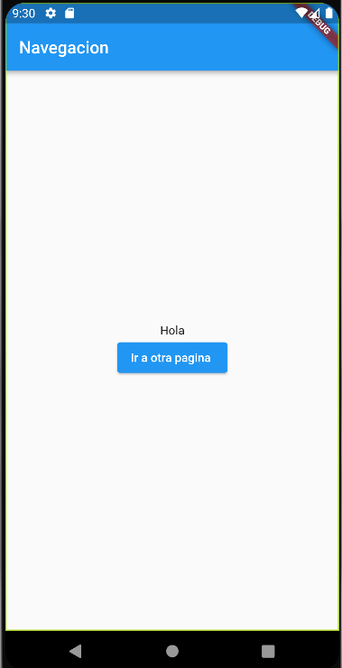
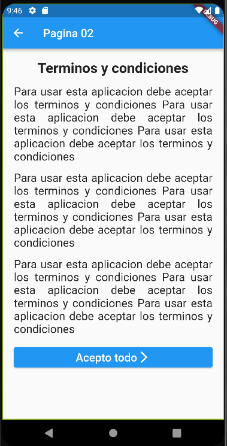

#  Navegación 

Una buena practica en flutter es craer archivos .dart para hacer las paginas de la aplicacion en este capitulo se vera la navegacion entre pantallas del aplicativo 

Para esto se crearemos un botton con el widget de  "ElevatedButton" y su estructura es la siguiente 

    import 'package:helllo_word/Pagina02.dart';

    ElevatedButton( //La palabra RaisedBottun() quedo obsoleta 
        child: Text("Ir a otra pagina "), //Child donde contiene el texto del boton
        onPressed: ()=>{ //Funcion que hara al momento de precionar este boton 
          Navigator.push( //la condicion que queremos que haga 
            context, //Contexto de que hara 
            MaterialPageRoute(builder: (context)=>Pagina02()) //Especificacion de a que pagina se dirije y tambien se nos agrega la nueva variable import atumaticamente 
            )
        }
    )

Despues seguimos con la creacion de un archivo .dart en el cual vamos a guardar la otra pagina del aplicativo 

Seguimos detallando algunos detalles del texto de la pagina 02 como agradar el texto y decorar mejor el boton

    import 'package:flutter/material.dart';
    
    class Pagina02 extends StatelessWidget {
      const Pagina02({super.key});
    
      @override
      Widget build(BuildContext context) {
        return Scaffold(
          appBar: AppBar(
            title: Text("Pagina 02"),
          ),
          body: Padding(
            padding: const EdgeInsets.all(20),
            child: Column(
              children: [
                Text("Terminos y condiciones", style: TextStyle(fontSize: 25, fontWeight: FontWeight.bold),),   SizedBox(height: 15,),
                Text("Para usar esta aplicacion debe aceptar los terminos y condiciones Para usar esta  aplicacion debe aceptar los terminos y condiciones Para usar esta aplicacion debe aceptar los    terminos y condiciones", style: TextStyle(fontSize: 20), textAlign: TextAlign.justify,),SizedBox   (height: 15,),
                Text("Para usar esta aplicacion debe aceptar los terminos y condiciones Para usar esta  aplicacion debe aceptar los terminos y condiciones Para usar esta aplicacion debe aceptar los    terminos y condiciones" , style: TextStyle(fontSize: 20), textAlign: TextAlign.justify,),SizedBox  (height: 15,),
                Text("Para usar esta aplicacion debe aceptar los terminos y condiciones Para usar esta  aplicacion debe aceptar los terminos y condiciones Para usar esta aplicacion debe aceptar los    terminos y condiciones", style: TextStyle(fontSize: 20), textAlign: TextAlign.justify,),
                SizedBox(height: 15,),
                ElevatedButton(
                  child: Row(
                    mainAxisAlignment: MainAxisAlignment.center,
                    children: [
                      Text("Acepto todo", style: TextStyle(fontSize: 20),),
                      Icon(Icons.arrow_forward_ios)
                  ]), 
                  onPressed: ()=>{
                    Navigator.pop(context)
                  } )
              ]),
          ),
        );
      }
    }

