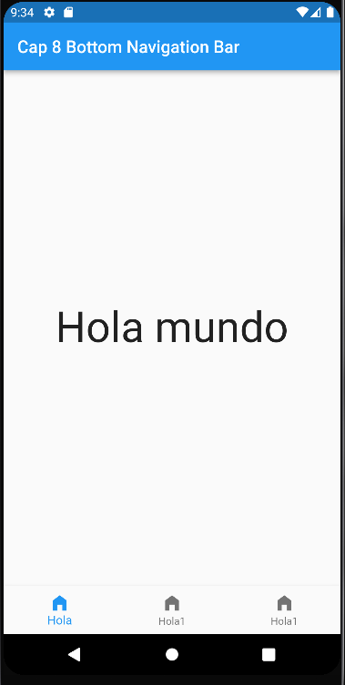
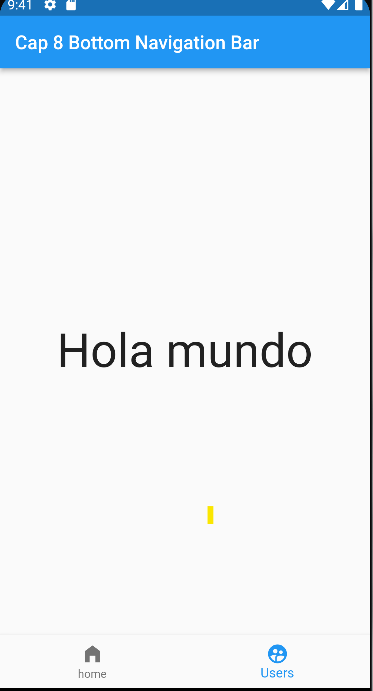
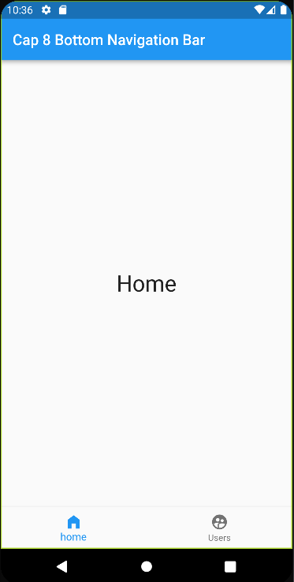
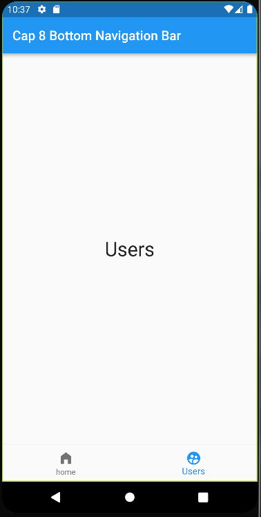

# Bottom Navigation Bar

El Bottom Navigation Bar es un elemento del Scaffold que este puede contener varios elementos como Appbar, el body el flotin boton que tiene en el constar 

**Ejemplo**

El bottomNavigationBar nesecita una propiedad del scaffold  BottomNavigationBar() dentro de los () llamamos los items:[] que es como un children que recibe un widget en especifico que es la lista de items que contiene y queda asi 

    bottomNavigationBar: BottomNavigationBar(
            items: [
              BottomNavigationBarItem(icon: Icon(Icons.home_filled), label: "Hola"),//Estos items debeen tener el label que es el titulo que recibe un texto
              BottomNavigationBarItem(icon: Icon(Icons.home_filled), label: "Hola1"),
              BottomNavigationBarItem(icon: Icon(Icons.home_filled), label: "Hola1")
            ],
        )

los arraiw en flutter empienza con 0 no con 1 asi seria para determinar el item donde inicia asi dentro del bottomNavigationBar

    currentIndex: 1

## Cambio de estilos

para cambiar los estolos de bottomNavigationBar primero debemos cambiar el estado dek widget principal a StatefulWidget con ctrol + . se puede cambiar el estado de la pantalla

    int _paginaActual = 1;

    bottomNavigationBar: BottomNavigationBar(
            onTap: (index){
                
            },
            currentIndex:_paginaActual,
            items: [
              BottomNavigationBarItem(icon: Icon(Icons.home_filled), label: "home"),
              BottomNavigationBarItem(icon: Icon(Icons.supervised_user_circle), label: "Users")
        ],
    ),

## OnTap 

Esta propiedad funciona en el bottomNavigationBar que esta propiedad recibe una funcion esta funcion recibe un interger en los ()

    onTap: (index){
                setState(() {
                  _paginaActual = index;
            });
        },

lo que hace este onTap es que cambia el estado del currentIndex llamando a la funcion _paginaActual que mira el valor actual y lo actualiza 

## Cambiar contenido del Body

primero crearemos 2 nuevas clases que van contener los widgets del body guardados 

Existe 2 formas de cambiar de contindo del body en flutter una poco ortodoxa y una mas escalable 

### Primera forma ###

En el body del widget principal crearemos un operador ternario llamando a la funcion _paginaActual diciendo que si es igual a 0 este en pagina home sino cambie a PaginaUsers asi queda 

    body: _paginaActual == 0 ? PaginaHome(): PaginaUser(),

revisa la comparacion pero es poco escalable 

### Segunda forma ###

La segunda forma es con la creancion de una lista de widget que contiene los disntintos widgeets de esta forma 

    List<Widget> _Paginas = [ //La lista es de tipo widgets dentro contiene la lista
    PaginaHome(), //Los widgets de la lista
    PaginaUser()
    ];

Luego de eso llamamos a la lista en el body y en la lista llamamos a la funcion _paginaActual

    body: _Paginas[_paginaActual],

Esta es la mejor forma de llamar a varios widgets porque es mas escalable 

*** Resultado ***

 

## Observacion

Para mas entendible el codigo se puede crear archivos donde se van a contener las clases de los widgets para sea mas entendible el codigo

[Resultado](/Cap_8_Bottom%20Navigation%20Bar/lib/)