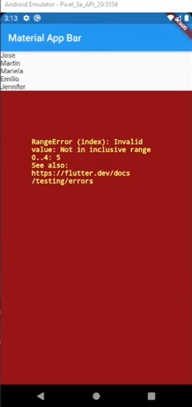
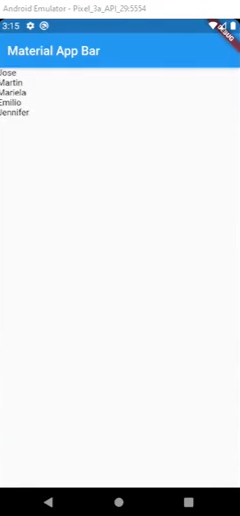
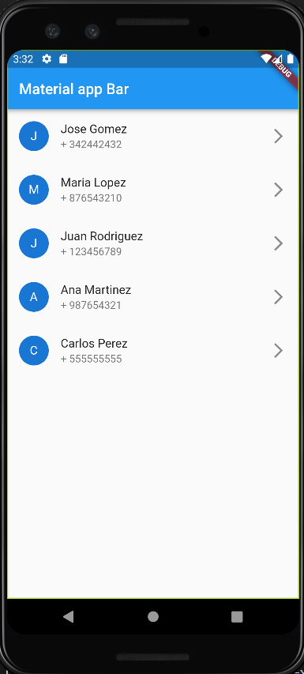
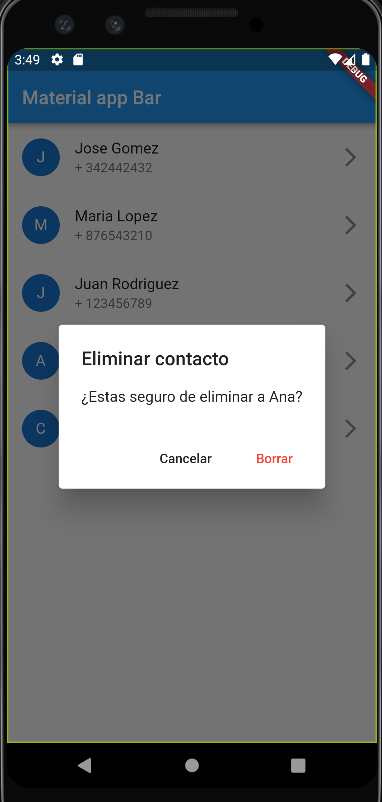

# Consumiendo un API REST ≫ Listas

En este video aprenderemos que es una lista y como usarla para crear ciclos repetitivos con esta funcion 

## Crear clase de datos 

Para traer una lista primero debemos crear un clase de datos de personas que en esa clase se van a guardar los datos de las personas y es asi :

    class Persona{
    String? name;
    String? lastname;
    String? phone; // numero debe ser un string 

    Persona( name,  lastname,  phone){
    this.name = name;
    this.lastname = lastname;
    this.phone = phone;
    }
    }

Esta clase debe tener un constructor por defecto 

## Crear lista de personas 

Para crear una lista toca poner la palabre List despues los <> indicando a que clase va a ser referencia la lista seguido del nombre que le vamos a poner a la lista que es _personas con unos [] ahi pobremos poner los valores de la clase que hacemos referencia.

  List<Persona> _personas = [];

La lista con valores se veria asi:

    List<Persona> _personas = [ //Lista de datos en flutter se crea con Lista y el <> especifica la clase que creamos la lista
    Persona("Jose", "Gomez", "+ 342442432"), //Se puede observar la lista de personas 
    Persona("Maria", "Lopez", "+ 876543210"),
    Persona("Juan", "Rodriguez", "+ 123456789"),
    Persona("Ana", "Martinez", "+ 987654321"),
    Persona("Carlos", "Perez", "+ 555555555")
    ];

### Truco 

En visual hay una obcion que si precionamos f2 sobre una clase le podemos cambiar el nombre a todas las instacias de la clase sin tener que ir una por una.

## Como utilizar listas

Nos dirijemos al widget de body y escribimos LisView seguido de una punto para identidicar el builder que este es como un constructor de itens y dentro de los () de este va el itemBuilder este recibe un contexto seguido del index esto es para que flutter sepa donde dibuja los itens seguido ingresamos return que este sera el texto "Text(_personas[index].name.toString())" es importante decir que el tipo de dato es toString()

    body:ListView.builder( //Escribir lista de personas en el body 
        itemBuilder:(context, index){
        return Text(_personas[index].name.toString())};
    )

cuando insertamos esta lista asi nos sale este error 

Este error sucede porque el builder no sabe cuando parar, para esto insertamos itemCount: _personas.length esto lo que hace es determinar el rango de personas que van a aparecer en la lista es asi

    body:ListView.builder( //Escribir lista de personas en el body 
        itemCount: _personas.length,
        itemBuilder:(context, index){
        return Text(_personas[index].name.toString())};
    )

Solucion ejemplo 

## Cosas que se pueden hacer en el return ListTile

Dentro de esta clase podemos insertar los dintintos datos de la lista, tambien se puedn estilicar estilos y llamar funciones al momento de precionar un dato de la lista 

    return ListTile(
        onLongPress: (){ //se llama a algo por onLongPress que funcion por precionar con tiempo prolongado puede ser una funcion 
            this._borrarPersona(context, _personas[index]); //Funcion a la cual estamos llamando  la cual nesecita un contexto
        },
        title: Text(_personas[index].name.toString()+ " " + _personas[index].lastname.toString()), Nombres en grande 
        subtitle: Text(_personas[index].phone.toString()), //Subtitulo numero 
        leading: CircleAvatar( //Insertando un circulo al lado de los nombres de la lista
        child: Text(_personas[index].name.toString().substring(0,1)), //Especificando que la primerletra aparezca en el circulo 
        ),
          trailing: Icon(Icons.arrow_forward_ios), //Fecha en cada nombre 
        );

Resultado:

## Funcion borrarPersona 

Esta funcion lo que hace es remover una persona de la lista preguntando primero se quiere borrar seguido se preciona borrar este desaparecer de la lista al instante asi se se va la funcion y se compone de la siguiente forma(la funcion debe estar en el widget principal).

    void _borrarPersona(context, Persona persona){
    showDialog( //Ventana que se inserta 
      context: context, //contexto de la ventana 
      builder: (_)=> AlertDialog( //constructor que trae la alerta 
        title: Text("Eliminar contacto"), //Titulo de la alerta 
        content: Text("¿Estas seguro de eliminar a " + persona.name.toString() + "?"), //Contenido junto el nombre 
        actions: [ //Actiones que pueden hacer en la alerta estas son 2 y estan dentro de []
          MaterialButton( //Tipo de boton ojo este debe ser material boton 
            onPressed: (){ //Lo que hace es actualizar al momento de precionar  
              Navigator.pop(context);
          }, child: Text("Cancelar")), //Nombre del boton
          MaterialButton( //Tipo de boton ojo este debe ser material boton 
            onPressed: (){ //Lo que hace es actualizar al momento de precionar                
              this.setState(() { //Esto lo que hace es cambiar el estado de la persona y lo remueve de la lista 
                this._personas.remove(persona);  
              });
              Navigator.pop(context);
          }, child: Text("Borrar ", style: TextStyle(color: Colors.red),)), //Nombre del boton con estilo
        ],
      )
    );
    }

Resultado:

