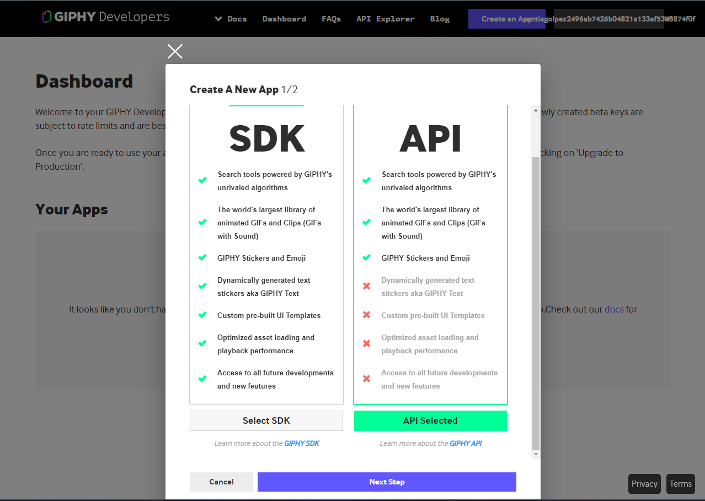
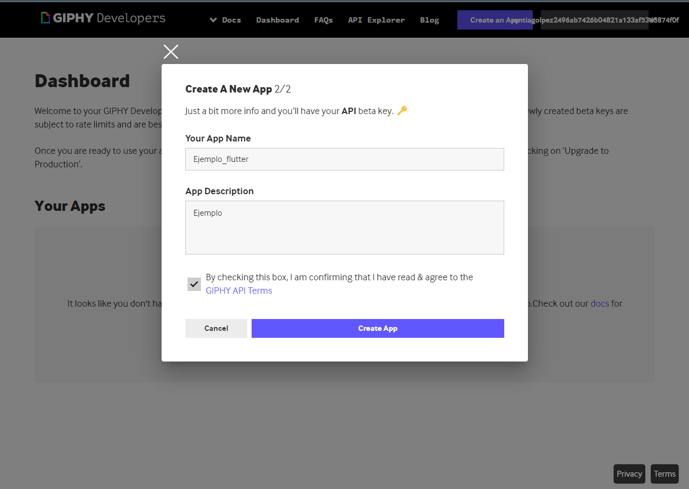
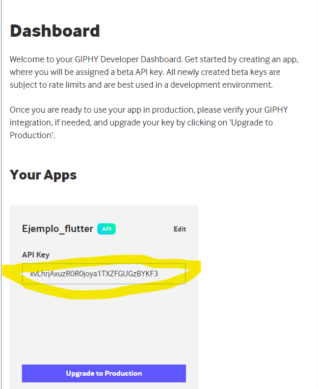
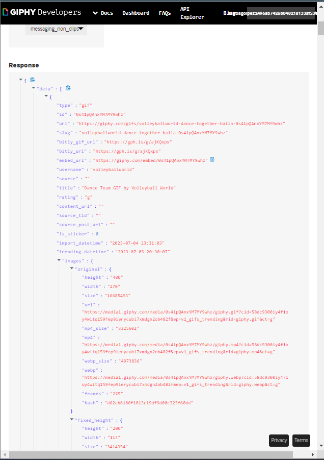

# Consumiendo un API REST ( Future / http )

En este video veremos vamos a poner en practica lo que aprendimos en anterioeres videos de clases clases y listas lo que vamos a hacer es consumir una API en flutter.

## Intacion de paquete 

Es paquete tieene la funcion de ayudarnos en hacer peticiones a internet y se instala de la siguiente forma 

**Primero:** 

Ingresamos al link [http](https://pub.dev/packages/http) que ahi encontraremos los datos del paquete http como su informacion y forma de instalacion 

**Segundo:**
Despues seguimos a la seccion de "Installing " que ahi nos dice en la depencia que debemos copiar 

    dependencies:// no es nesesario copiar dependencies
  http: ^1.1.0

## Confugarion pubspec.yaml

Ya con el paquete copiado nos dirijimos al proyecto de flutter en la carpeta "pubspec.yaml" en donde pegaremos el paquete en la seccion de "dependencias" de esta forma 

    dependencies:
      flutter:
        sdk: flutter
      cupertino_icons: ^1.0.2
      http: ^1.1.0 //paquete que copiamos 

despues de eso presionamos ctrl + s para guardar los cambios verificando que tengamos la ultima version de flutter 

## Como consumir una API ya creada

Nos dirijiemos a la pagina de [GIPHY](https://developers.giphy.com/) con una cuenta logeada y damos clic en "Create an Appp" y nos aparece esta ventana 

selecionando la API se nos abre otra ventana para poner los datos de nuestra API

Despues podemos visualizar la API con el API Key la cual copiamos la direccion de la api como se ve 

Seguido de esto vamos a la seccion de API Explorer y escogemos que tipo de endpoints queremos que traiga y en parametros el limite de imagenes que queremos y damos Send Request 

el objecto que vemos es la api 

## Comensando 

Creamos una llamamda gif que contiene el nombre de los gits y la url con su constructor 

    class Gif {
    
    String? name;
    String? url;

    Gif(name, url ){
      this.name = name;
      this.url = url ;
    }
  }

Esta clase la vamos a guardar en otra carpeta en un "models" donde estara el archivo .dart llamado Gif.dart

seguido hacemos la importacion de la carpeta en el archivo principal 

## Future 

El future lo que hace es determninnar el tiempo  de espera de una peticion hasta que se resuelva.

los future nesecitan una variable que contenga un future y se haria asi 

  Future<List<Gif>>? _listadoGifs;

este future recibe un listado de gifs y tiene el nombre de _listadoGifs para recibir estos valores toca hacer una funcion que los devuelva y se compone asi:

  Future<List<Gif>> _getGifs(){}

dentro de esta funcion construiremos los parametros que es un response que da a igual a un parametro http de tipo get que den:

  Future<List<Gif>> _getGifs() async { //funcion ansincrona 
    final response = await http.get(Uri.parse("https://api.giphy.com/v1/gifs/trending?api_key=xvLhrjAxuzR0R0joya1TXZFGUGzBYKF3&limit=10&offset=0&rating=g&bundle=messaging_non_clips")); //Para llamar la url nesecitamos una clase Uri que requiere un parse dentro de las ()

    await// solo se puede utilizar en una funcion ansincrona 
  }

para que este parametro funcione toca hacer una importacion de un paquete de dart que es

  import 'package:http/http.dart' as http; //Nombre que le asignamos al paquete

Luego esteblecemos parametros de if y else para validar la conexion a la API

    if(response.statusCode == 200){
      print(response.body); //imprime informacion en caso de que funcione

    }else{
      throw Exception("Fallo la conexion");
    }
  
lo que hace el if es que si hay conexion 200 si pase la validacion de conexion del future sino el else reportara un fallo de conexion.

## Ejecutar initState

Para ejecutar nuestro future usaremos la funcion propia de flutter de initState que hace es ejecutar el programa al abrirse.

  @override
  void initState() { //Es una funcion que se ejecuta cuando se abre una ventana 
    super.initState();
    _listadoGifs = _getGifs();
  }

## Configurando if 

Seguimos con el if estableciendo un Strig del body que lo imprima en utf8 esto facilita la lectura de la API, seguido es combertir el body que es un string en un objeto JSON para que lea mejor la lectura .
  
  if(response.statusCode == 200){
      String body = utf8.decode(response.bodyBytes);

    }else{
      throw Exception("Fallo la conexion");
    }

  seguido de esto convertimos el body que es un string a un objeto Json ais 

    final jsonData = jsonDecode(body);

  cuando se usa "jsonDecode" se debe importar el paquete esto se hace automaticamente luego seguimos llamando la lista de gifs

    List<Gif> gifs = [];

  para navegar en un objecto Json en flutter y obtener su informacion se usa 

    print(JsonData ["Data"][0]["type"])

  para que nos imprima la informacion de la api que estamos consultando 

  ## For 

Despues nesecitamos hacer un recorrido de la lista para esto se puede con un for que en sus parametros estableceres los recorridos por el JsonData y establecemos que recorra la api de gifs, seguido dentro de las {} le decimos que agrege gifs.add llamando al objecto gifs estableciendo que el primer parametro es el titulo y el segundo la url de la imagen como se observa.

      for (var item in jsonData["data"]) {
        gifs.add(
          Gif(item["title"], item["images"]["downsized"]["url"]));
      }

al final ponemos que nor retorne return gifs; y ya ahi terminaria el future de la lista de gifs

por ultimo vamos iniState y agregamos que _listadoGifs = _getGifs(); como se puede ver 

  void initState() { //Es una funcion que se ejecuta cuando se abre una ventana 
    super.initState();
    _listadoGifs = _getGifs();
  }

# Fin de parte 1